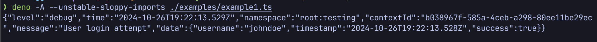
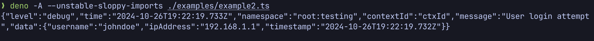
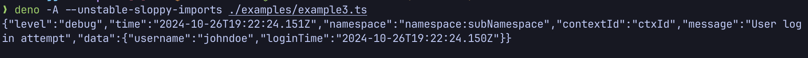
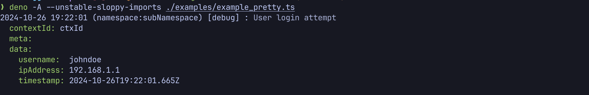
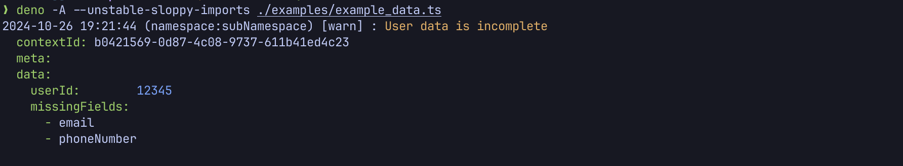
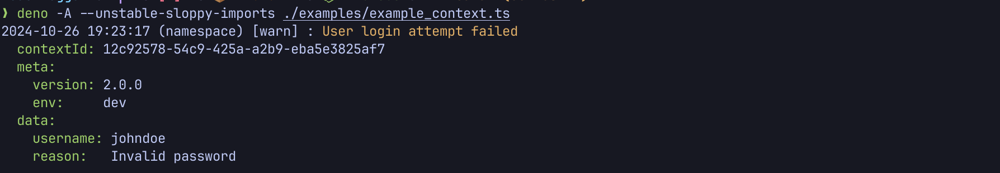

# @ekino/logger

A lightweight, flexible logger that merges debug-style namespace management, Winston-inspired log levels, and customizable multi-output functionality.

[![NPM version][npm-image]][npm-url]
[![Coverage Status][coverage-image]][coverage-url]

## Table of Contents
-   [Features](#features)
-   [Installation](#installation)
-   [Usage](#usage)
    -   [Basic logging](#basic-logging)
    -   [Context ID](#context-id)
    -   [Namespaces and levels](#namespaces-and-levels)
    -   [Output formats](#output-formats)
        -   [JSON format](#json-format)
        -   [Pretty format](#pretty-format)
        -   [Custom output functions](#custom-output-functions)
    -   [Log data and metadata](#log-data-and-metadata)
        -   [Adding global metadata](#adding-global-metadata)
    -   [Force logging](#force-logging)
-   [Benchmark](#benchmark)
-   [Contributing](#contributing)

## Features
- **Configurable log levels**: Set log levels globally or per namespace for detailed control.
- **Flexible output formats**: Supports JSON, Pretty-print, and custom output adapters.
- **Context ID support**: Optionally track logs across function calls by assigning a unique context ID.
- **Type-safe & developer-friendly**: Fully written in TypeScript for improved safety and ease of use.
- **Dual module support**: Supports both ESM and CommonJS imports.
- **Cross-environment compatibility**: Works with Node.js, Deno, and Bun environments.

## Installation

Install via npm, yarn or pnpm:
```sh
npm  add @ekino/logger
yarn add @ekino/logger
pnpm add @ekino/logger
```

## Usage

By default, `@ekino/logger` outputs `warn` and `error` levels for all namespaces, with logs written to stdout in JSON format. 

Adjust the log level globally or per namespace using the `LOG_LEVEL` environment variable or programmatically with `setLevel` and `setNamespaces`.

### Basic logging

`@ekino/logger` provides five log levels: `trace`, `debug`, `info`, `warn`, and `error`. Setting a specific level enables it and all higher-priority levels. 

By default, setting info will enable `info`, `warn`, and `error`, but not debug or trace. The log levels are defined as:

Log level priorities:
```js
{ trace: 0, debug: 1, info: 2, warn: 3, error: 4 }
```

Example:

```js
import { setNamespaces, setLevel, createLogger } from '@ekino/logger'

setNamespaces('root:*')
setLevel('debug')

const logger = createLogger('root:testing')
logger.debug('Sample debug message', { foo: 'bar' })
```

Output example:



### Context ID

For traceability, the logger supports a `contextId`, helping to link logs across calls. You can either provide a custom `contextId` or let the logger auto-generate one.

```js
const logger = createLogger('app:example')
logger.debug('ctxId', 'Log with predefined context ID', { foo: 'bar' })
// Or logger.debug('Log with predefined context ID', { foo: 'bar' })
```

Output example:



### Namespaces and levels

Namespaces offer flexibility for selectively enabling logs. Set a default global log level and configure specific namespaces with unique levels, including `none` to disable.

To configure namespaces:
```js
const { setLevel, setNamespaces } = require('@ekino/logger')

setLevel('info')
setNamespaces('*,database*=debug,database:redis*=none')
```

Example of using namespace-specific logging:

```js
const loggerA = createLogger('namespace:subNamespace')
const loggerB = createLogger('namespace:mute')

loggerA.debug('This will be logged')
loggerB.info('This will not be logged')
```

### Output formats

@ekino/logger supports multiple output formats with default JSON logging to `stdout`. You can enable `pretty` output or create custom adapters.

#### JSON format

The JSON output adapter logs structured data, ideal for integration with log collectors.

```js
setOutput(outputs.json)
const logger = createLogger('namespace:subNamespace')
logger.debug('ctxId', 'Log message', { someData: 'value' })
```

Output example:



#### Pretty format

The Pretty format outputs logs in a YAML-like style for enhanced readability in local development.

```js
setOutput(outputs.pretty)
const logger = createLogger('namespace:subNamespace')
logger.debug('ctxId', 'Log message', { someData: 'value' })
```

Output example:



#### Custom output functions

Custom output functions allow flexible handling of log data. Pass an array of adapters for multiple outputs.

```js
const consoleAdapter = (log) => {
    console.log(outputUtils.stringify(log))
}

setOutput([outputs.pretty, consoleAdapter])
const logger = createLogger('namespace:subNamespace')
logger.debug('ctxId', 'Log message', { someData: 'value' })
```

### Log data and metadata

Adding metadata to logs enhances context and helps filter data in log collectors. Add custom data directly or globally to each log instance.

```js
const logger = createLogger('namespace:subNamespace')
logger.warn('Log message', { additionalData: 'value' })
```

Output example:



#### Adding global metadata

Use `setGlobalContext` to add metadata, such as app version or environment, to all log entries.

```js
setGlobalContext({ version: '2.0.0', env: 'dev' })
const logger = createLogger('namespace')
logger.warn('Log message', { additionalData: 'value' })
```

Output example:



### Force logging
Override the log level for critical messages by forcing them to be logged:
```js
logger.debug('Will be logged regardless of level', { forceLogging: true });
```

## Benchmark
Below is a performance comparison of several popular Node.js logging libraries, including @ekino/logger. Benchmarks were conducted using Node.js v22.10.0, with results measured in operations per second (higher values indicate better performance).
```bash
┌─────────┬──────────────────────┬───────────┐
│ (index) │ library              │ ops/sec   │
├─────────┼──────────────────────┼───────────┤
│ 0       │ 'Pino'               │ '124,828' │
│ 1       │ '@ekino/logger v3.x' │ '118,385' │
│ 2       │ '@ekino/logger v2.x' │ '104,004' │
│ 3       │ 'Winston'            │ '67,536'  │
└─────────┴──────────────────────┴───────────┘
```
**Note**: Benchmark results may vary depending on environment and configuration. This table provides a general reference for relative performance between libraries.

For more detailed benchmark results, please refer to the [benchmarks](./benchmarks/) folder.

## Contributing

Contributions are welcome! Please refer to our [CONTRIBUTING.md](CONTRIBUTING.md) for guidelines on submitting issues, improvements, and more.

[npm-image]: https://img.shields.io/npm/v/@ekino/logger.svg?style=flat-square
[npm-url]: https://www.npmjs.com/package/@ekino/logger
[coverage-image]: https://img.shields.io/coveralls/ekino/node-logger/master.svg?style=flat-square
[coverage-url]: https://coveralls.io/github/ekino/node-logger?branch=master